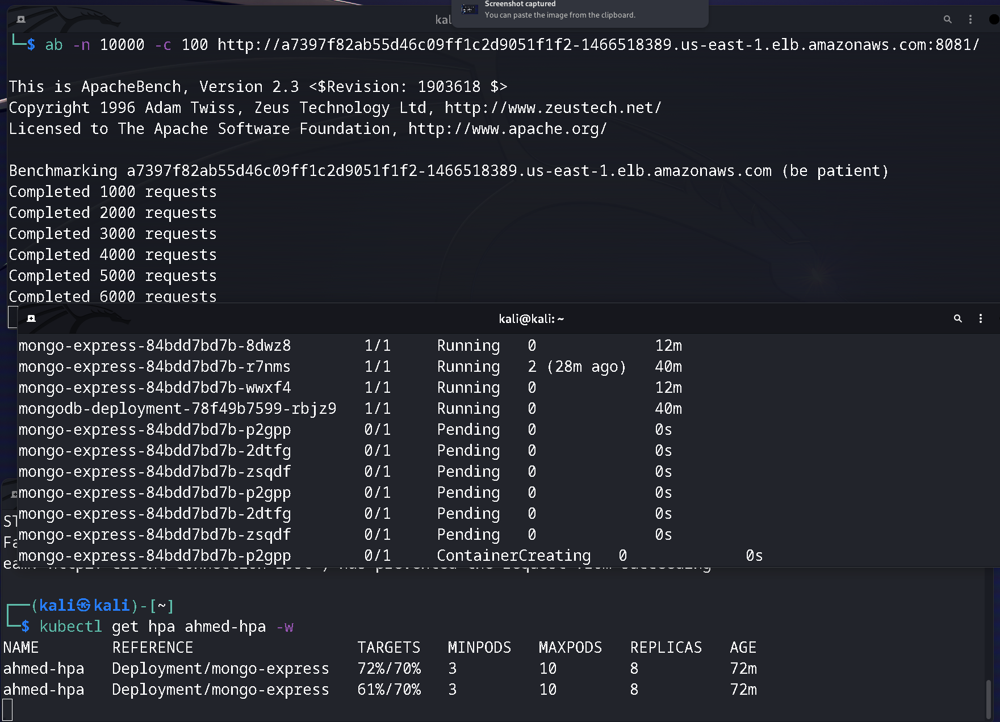

# EKS cluster

## Steps-by-step guide for creating auto-scaling Kubernetes cluster on AWS
1. Get access key and secret from security credentials under my account menu
 - aws configure 
put access key, secret and your default region (us-east-1 in our case)
2. Create VPC for worker nodes from cloud formation service
S3 bucket link
https://s3.us-west-2.amazonaws.com/amazon-eks/cloudformation/2020-10-29/amazon-eks-vpc-private-subnets.yaml
3. Create IAM role for EKS to allows access to other AWS service resources that are required to operate clusters managed by EKS.
 - EKS - Cluster role for EKS service (according to AWS documentation )
4. Open the Amazon EKS console at https://console.aws.amazon.com/eks/home#/clusters.
Create your cluster
5. Connect kubectl with your EKS cluster 
 - aws eks update-kubeconfig --name ThinkOn-EKS-Cluster
6. Create IAM role for node group (EC2 instances) because kubelet in the worker nodes need permission to talk to other aws services (We create IAM role for the EC2 because the node group is created from bunch of EC2 instances)
 - AMAZON EKS WORKER NODE POLICY (access to EC2 and EKS in read mode)
 - AMAZON EC2 CONTANER REGISTERY READ ONLY (to pull images from the ECR)
 - AMAZON EKS CNI POLICY (to interact with other EC2 instances)
7. Create your node group
8. Deploy our K8S YAML files (including metrics server)
9. Connect to our mongo express deployment on port 8081
10. Test the HPA --->
 -  ab -n 10000 -c 100 http://a7397f82ab55d46c09ff1c2d9051f1f2-1466518389.us-east-1.elb.amazonaws.com:8081/

## To perform a rolling update:
kubectl set image deployment/my-deployment-name container-name=new-container-image 

## To perform a rollback:
kubectl rollout undo deployment/my-deployment-name

## Documentation
https://docs.aws.amazon.com/eks/latest/userguide/getting-started-console.htmlprerequisites

## Auto-scaling
|
|
